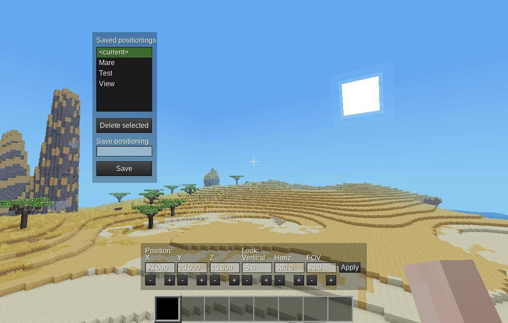

# Dev Positioning - Positioning player
## A Minetest mod for mod developpers

This mods helps positioning player for screenshots or demos.

It allows to precisely adjust position, look direction and field of view, and saves and recall positionings.

**Version**: Alpha

**Dependancies**: none

**License**: MIT License

**See also**: [Minetest forum thread](https://forum.minetest.net/viewtopic.php?t=25249)

## How to use this mod

You need the `server` priv. Issue `/devpos` command, this will open two windows.

On the bottom window, X, Y, Z, look vertical, look horizontal and FOV can be adjusted.

Apply button is for applying positionning when entered with keyboard.

The left window allows to save, recall and delete different positionning.

Save: Type a name and click on save button.

Recall: Select a positioning in the list.

Delete: Select a positioning and click on delete button.
  
